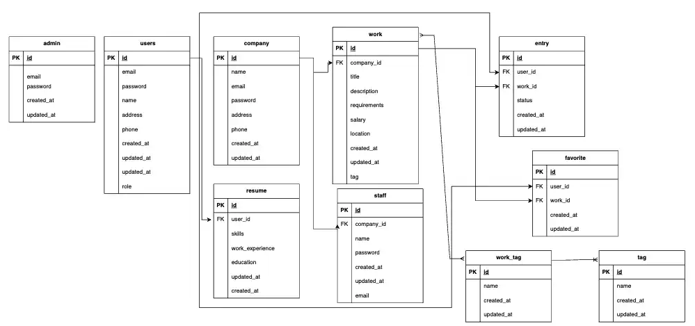

# 自己学習用に作成している求人サイトです

これはLaravelで作成されたWebアプリケーションです。
求職者が仕事を見つけ、企業が求人情報を投稿するための機能を提供します。求職者、企業、管理者向けの機能が含まれています

# 主なページと機能 

# 要件

* 求職者向け機能
求人情報の検索および応募が可能。
求人詳細の閲覧が可能。
求人をお気に入りに登録可能。
ユーザー登録およびログイン機能。

* 企業向け機能
求人情報の投稿が可能。
求人応募者の情報を管理可能。
応募者の詳細情報の閲覧および選考ステータスの変更が可能。
企業の登録およびログイン機能。

* 管理者向け機能
すべての企業および求職者情報の閲覧が可能。
サイト内のすべての情報を管理可能。

* 一般要件
連絡はメールで行い、チャット機能は含まれない。
求人情報は誰でも閲覧可能。
応募にはユーザー登録およびログインが必要。
ユーザー情報は応募した企業のみが閲覧可能。
管理者アカウントはすべての情報にアクセス可能。
ログインにはメールアドレスとパスワードが必要。
求人のお気に入り機能を実装。
求人一覧は新しい順に表示。
ログインしているユーザーは簡単に応募可能。
ログインしていないユーザーはログインまたはアカウント作成を促す画面へ移動。
ユーザー登録時のメールアドレスはユニークであること。
パスワードは半角英数字混在で8文字以上。
ログインの有無にかかわらず求人をお気に入りに登録可能。
お気に入り求人を一括で応募可能。

# 使用している技術
* Laravel
* TailwindCSS
* HTML&CSS
* MySQL

#　データベース

# 環境構築

# 作成者 

* uheiji
